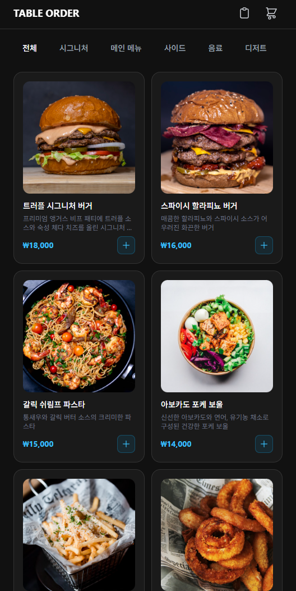
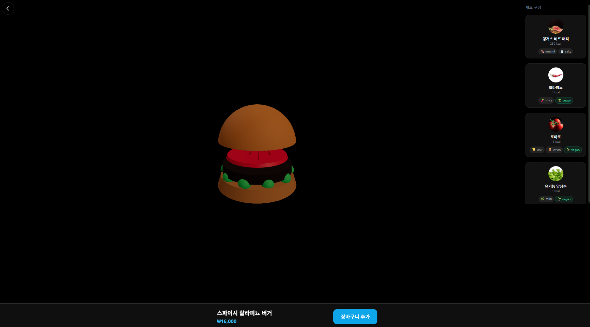
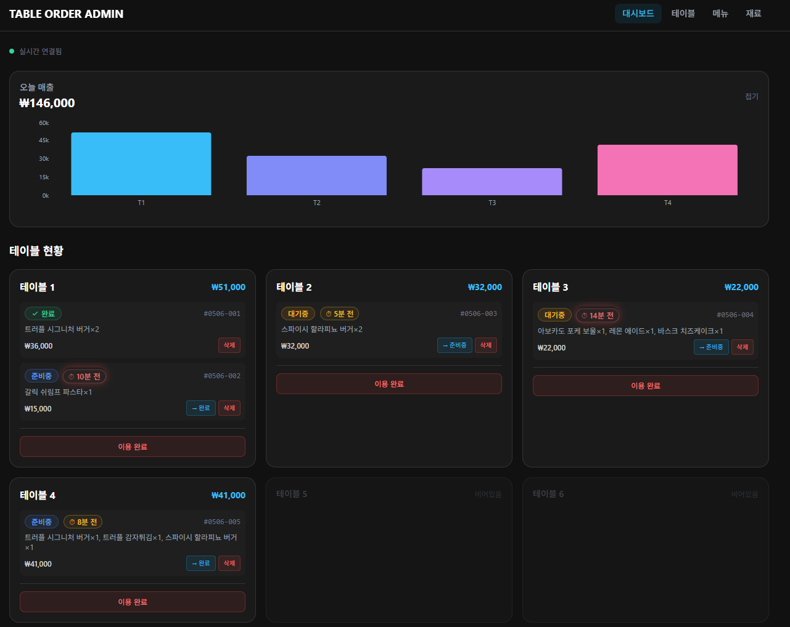
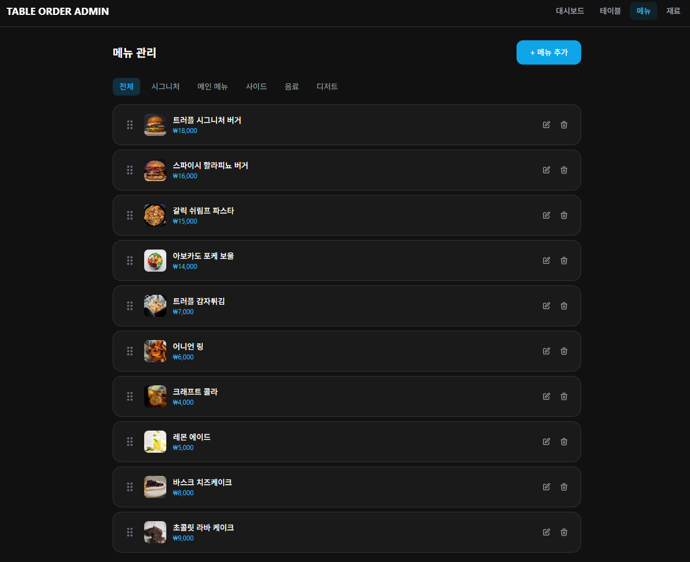

# 🍽️ Table Order - Premium Dining Experience

차세대 프리미엄 테이블오더 플랫폼입니다. 고객에게는 **3D 메뉴 시각화와 재료 기반 정보**를, 매장 운영자에게는 **실시간 주문 모니터링과 경과 시간 시각화**를 제공합니다.

## ✨ 핵심 차별화

| 기능 | 설명 |
|------|------|
| 🎮 **3D 메뉴 시각화** | 코드 기반 프로시저럴 3D 음식 모델 (React Three Fiber) |
| 🥗 **재료 기반 정보** | 각 메뉴의 재료별 칼로리, 맛 프로필, 비건 여부 표시 |
| ⏱️ **주문 경과 시간** | 3단계 색상 변화 (초록→주황→빨강) + 경고 펄스 애니메이션 |
| 📊 **실시간 매출 차트** | 테이블별 매출 바 차트 |
| 🖱️ **드래그 앤 드롭** | 메뉴 순서 직관적 관리 |
| 🌙 **다크 모드 프리미엄** | 블랙 배경 기반 고급스러운 UI |

---

## 📸 서비스 미리보기

### 고객용 - 메뉴 리스트

카테고리별 필터링과 고품질 음식 사진으로 구성된 메뉴 탐색 화면입니다. 다크 모드 프리미엄 테마로 고급스러운 분위기를 연출합니다.



### 고객용 - 메뉴 상세 (3D + 재료 정보)

블랙 배경 위에 프로시저럴 3D 음식 모델이 회전하며, 우측에는 각 재료의 칼로리·맛 프로필·비건 여부가 표시됩니다. 마우스 드래그로 3D 모델을 자유롭게 회전할 수 있습니다.



### 관리자용 - 실시간 대시보드

테이블별 매출 차트와 주문 현황을 한눈에 파악할 수 있습니다. 주문 경과 시간에 따라 색상이 변하며(초록→주황→빨강), 10분 이상 경과된 주문은 펄스 애니메이션으로 즉시 눈에 띕니다.



### 관리자용 - 메뉴 관리

드래그 앤 드롭으로 메뉴 노출 순서를 직관적으로 조정할 수 있습니다. 메뉴 추가/수정/삭제와 이미지 업로드를 지원합니다.



---

## 🏗️ 서비스 구성

```
┌─────────────────────────────────────────────────────────┐
│                    Table Order System                     │
├──────────────────────┬──────────────────────────────────┤
│   고객용 인터페이스    │        관리자용 인터페이스         │
│                      │                                  │
│  • 메뉴 탐색 (3D)    │  • 실시간 주문 대시보드           │
│  • 재료 정보 확인     │  • 주문 경과 시간 시각화          │
│  • 장바구니 관리      │  • 테이블 관리 (세션 제어)        │
│  • 주문 생성/조회     │  • 메뉴 관리 (CRUD + DnD)       │
│  • 주문 상태 확인     │  • 재료 관리                     │
│                      │  • 매출 차트                     │
└──────────────────────┴──────────────────────────────────┘
```

## 🛠️ 기술 스택

### Frontend
| 기술 | 용도 |
|------|------|
| React 18 + TypeScript | UI 프레임워크 |
| Vite | 빌드 도구 |
| Tailwind CSS | 스타일링 (다크 모드 커스텀 테마) |
| Zustand | 클라이언트 상태 관리 |
| TanStack React Query | 서버 상태 관리 |
| React Three Fiber + Drei | 3D 렌더링 |
| Framer Motion | 애니메이션 |
| Recharts | 차트 |
| dnd-kit | 드래그 앤 드롭 |
| Axios | HTTP 클라이언트 |

### Backend (개발 예정)
| 기술 | 용도 |
|------|------|
| Node.js + Express + TypeScript | REST API |
| TypeORM + MySQL | 데이터베이스 |
| JWT + bcrypt | 인증 |
| Server-Sent Events (SSE) | 실시간 통신 |
| Multer | 파일 업로드 |

## 🚀 실행 방법

```bash
cd frontend
npm install
npm run dev
# http://localhost:3000 접속
```

### 주요 경로

| 경로 | 설명 |
|------|------|
| `/customer/menu` | 고객 메뉴 화면 (기본) |
| `/customer/menu/:id` | 메뉴 상세 (3D + 재료) |
| `/customer/cart` | 장바구니 |
| `/customer/orders` | 주문 내역 |
| `/admin/dashboard` | 관리자 대시보드 |
| `/admin/tables` | 테이블 관리 |
| `/admin/menus` | 메뉴 관리 (DnD) |
| `/admin/ingredients` | 재료 관리 |

> 현재 목업 모드로 동작합니다. 로그인 없이 모든 기능을 확인할 수 있습니다.

## 🎯 주요 시나리오

### 고객 플로우
1. 메뉴 탐색 → 카테고리별 필터링
2. 메뉴 상세 → 3D 모델 회전 + 재료 정보 (칼로리, 비건) 확인
3. 장바구니 담기 → 수량 조절
4. 주문 확정 → 성공 화면 (5초 카운트다운) → 메뉴로 복귀
5. 주문 내역에서 상태 확인 (대기중 → 준비중 → 완료)

### 관리자 플로우
1. 대시보드에서 실시간 주문 모니터링 + 매출 차트 확인
2. 경과 시간 색상으로 오래된 주문 즉시 파악 (10분+ 빨간색 펄스)
3. 주문 상태 변경 / 삭제
4. 테이블 이용 완료 처리 (세션 리셋)
5. 메뉴 추가/수정/삭제 + 드래그로 순서 변경
6. 재료 관리 (칼로리, 맛 프로필, 비건 태그)

## 👥 페르소나

| 페르소나 | 역할 | 핵심 니즈 |
|----------|------|-----------|
| 김민수 | 일반 고객 | 빠르고 편리한 주문 |
| 이지은 | 건강 관리 고객 | 재료/칼로리 정보로 메뉴 선택 |
| 최영호 | 까다로운 고객 | 3초 내 로딩, 충분한 정보, 주문 방치감 없음 |
| 박준호 | 매장 관리자 | 주문 놓치지 않기, 효율적 운영 |

## 📋 개발 방법론

이 프로젝트는 **AI-DLC (AI-Driven Development Life Cycle)** 워크플로우로 개발되었습니다:

- **Inception Phase**: 요구사항 분석 → User Stories → Application Design → Units Generation
- **Construction Phase**: Functional Design → Code Generation → Build & Test
- **병행 개발**: Frontend(목업) + Backend(API) 독립 개발 → 최종 연동

설계 문서는 `aidlc-docs/` 디렉토리에서 확인할 수 있습니다.

## 📄 라이선스

워크샵 교육용 프로젝트입니다.
