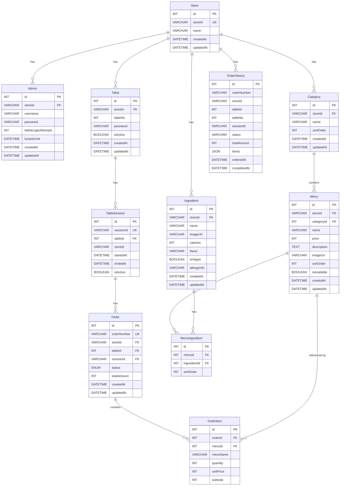

# ER Diagram - Backend API

## Mermaid ER Diagram



## 관계 요약 (텍스트)

```
Store (1) ─────┬──── (N) Admin
               ├──── (N) Table ──── (N) TableSession ──── (N) Order ──── (N) OrderItem
               ├──── (N) Category ──── (N) Menu ──────────────────────────────┘ (referenced)
               ├──── (N) Ingredient                         │
               └──── (N) OrderHistory                       │
                                                            │
                                          Menu (N) ──── MenuIngredient ──── (N) Ingredient
```

## CASCADE 규칙 시각화

```
Menu 삭제 ──→ MenuIngredient 자동 삭제 (CASCADE)
Ingredient 삭제 ──→ MenuIngredient 자동 삭제 (CASCADE)
Order 삭제 ──→ OrderItem 자동 삭제 (CASCADE)
Category 삭제 ──✕ Menu 존재 시 삭제 불가 (RESTRICT)
Table 삭제 ──✕ TableSession 존재 시 삭제 불가 (RESTRICT)
```

## 핵심 UNIQUE 제약

| 테이블 | UNIQUE 조합 | 목적 |
|--------|-------------|------|
| Store | storeId | 매장 식별자 유일성 |
| Admin | (storeId, username) | 매장 내 관리자명 유일 |
| Table | (storeId, tableNo) | 매장 내 테이블 번호 유일 |
| TableSession | sessionId | 세션 UUID 유일 |
| MenuIngredient | (menuId, ingredientId) | 중복 연결 방지 |
| Order | orderNumber | 주문 번호 유일 |
