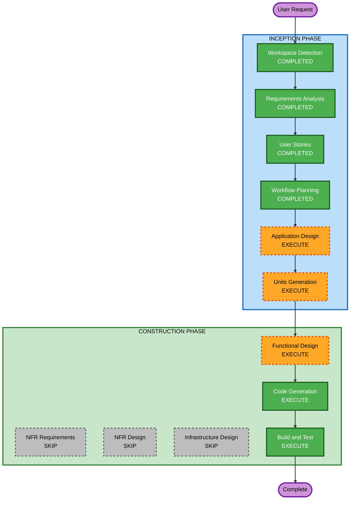

# Execution Plan

## Detailed Analysis Summary

### Change Impact Assessment
- **User-facing changes**: Yes - 고객용 주문 인터페이스 + 관리자 대시보드 전체 신규 구축
- **Structural changes**: Yes - 프론트엔드/백엔드 전체 아키텍처 신규 설계
- **Data model changes**: Yes - 매장, 테이블, 메뉴, 재료, 주문 등 전체 스키마 설계 필요
- **API changes**: Yes - REST API 전체 설계 (인증, 메뉴, 주문, 관리)
- **NFR impact**: Yes - 실시간 SSE, 3D 렌더링 성능, 파일 업로드

### Risk Assessment
- **Risk Level**: Medium (신규 프로젝트이나 3D 렌더링 + 실시간 통신 복합 기술)
- **Rollback Complexity**: Easy (Greenfield - 코드 삭제로 롤백)
- **Testing Complexity**: Moderate (SSE 실시간 테스트, 3D 렌더링 검증)

---

## Workflow Visualization



### Text Alternative
```
Phase 1: INCEPTION
- Workspace Detection (COMPLETED)
- Requirements Analysis (COMPLETED)
- User Stories (COMPLETED)
- Workflow Planning (COMPLETED)
- Application Design (EXECUTE)
- Units Generation (EXECUTE)

Phase 2: CONSTRUCTION
- Functional Design (EXECUTE, per-unit)
- NFR Requirements (SKIP)
- NFR Design (SKIP)
- Infrastructure Design (SKIP)
- Code Generation (EXECUTE, per-unit)
- Build and Test (EXECUTE)
```

---

## Phases to Execute

### INCEPTION PHASE
- [x] Workspace Detection (COMPLETED)
- [x] Requirements Analysis (COMPLETED)
- [x] User Stories (COMPLETED)
- [x] Workflow Planning (IN PROGRESS)
- [ ] Application Design - **EXECUTE**
  - **Rationale**: 신규 시스템으로 컴포넌트 식별, 서비스 레이어 설계, API 구조 정의 필요
- [ ] Units Generation - **EXECUTE**
  - **Rationale**: Frontend + Backend 복합 시스템으로 병렬 개발 가능한 단위 분해 필요

### CONSTRUCTION PHASE
- [ ] Functional Design - **EXECUTE** (per-unit)
  - **Rationale**: 데이터 모델, 비즈니스 로직(주문 플로우, 세션 관리), API 상세 설계 필요
- [ ] NFR Requirements - **SKIP**
  - **Rationale**: 요구사항에서 이미 NFR 정의 완료 (SSE 2초, 3D 60fps, 로딩 3초). 별도 tech stack 선정 불필요 (이미 결정됨)
- [ ] NFR Design - **SKIP**
  - **Rationale**: NFR Requirements 스킵으로 인해 자동 스킵
- [ ] Infrastructure Design - **SKIP**
  - **Rationale**: 로컬 개발 환경 우선, 배포는 추후 결정. 인프라 설계 불필요
- [ ] Code Generation - **EXECUTE** (per-unit, ALWAYS)
  - **Rationale**: 실제 코드 구현 (Planning + Generation)
- [ ] Build and Test - **EXECUTE** (ALWAYS)
  - **Rationale**: 빌드 및 테스트 지침 생성

### OPERATIONS PHASE
- [ ] Operations - **PLACEHOLDER**
  - **Rationale**: 향후 배포/모니터링 워크플로우 확장 예정

---

## Success Criteria
- **Primary Goal**: 차별화된 프리미엄 테이블오더 시스템 구축 (진상 손님도 만족)
- **Key Deliverables**:
  - 고객용 웹 인터페이스 (3D 메뉴, 재료 정보, 주문 상태 애니메이션)
  - 관리자용 대시보드 (실시간 모니터링, 경과 시간 UI, 매출 차트, DnD 메뉴 관리)
  - REST API 서버 (인증, 메뉴, 주문, SSE)
  - MySQL 데이터베이스 스키마
- **Quality Gates**:
  - 3초 이내 페이지 로딩
  - SSE 실시간 업데이트 2초 이내
  - 3D 렌더링 60fps
  - 터치 친화적 UI (44x44px 최소 터치 영역)
